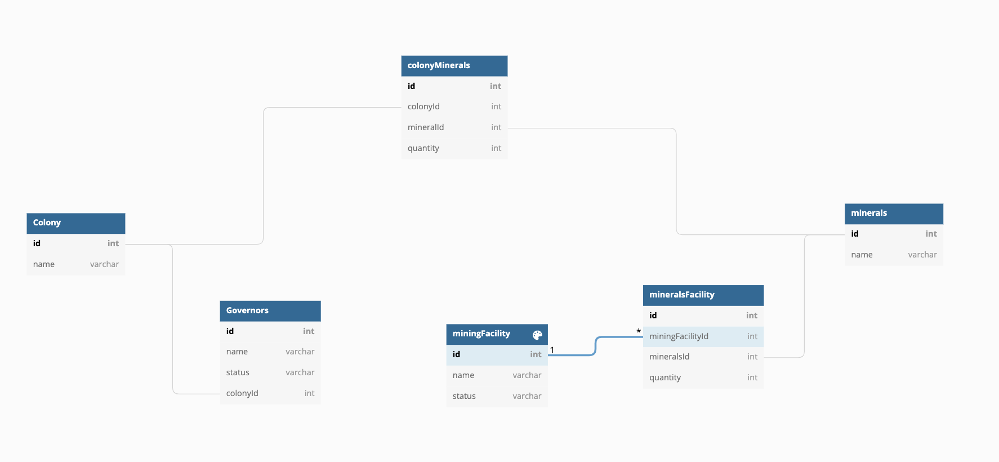
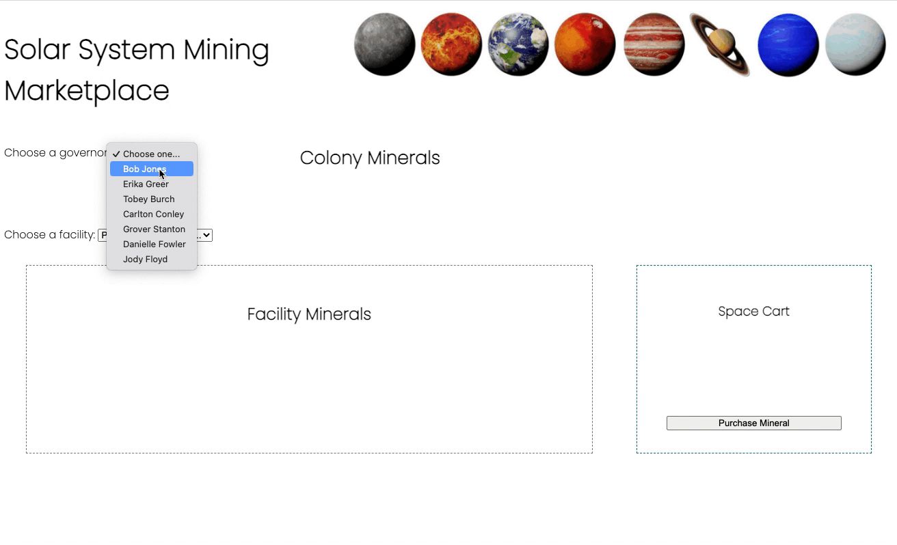

# Exomine

Exomine is an application that lets governors of different colonies in our Solar System purchase minerals from various mining facilities that humans have established.


## ERD



## Working Preview




## How To Get Started
Start by choosing one of the active governors in the Choose Governor dropdown. Next, choose one of the active facilities and start buying minerals!
Resources are a hot commodity, only 1 ton of any type of mineral can be purchased at a time. However, you can purchase many types of minerals at once. 
Add these minerals to your cart, purchase them, and watch your inventory magically update!

## How To Clone Our Project
1. Open your terminal, cd to your workspace, type in the following, and press Enter:
```sh
git clone git@github.com:camillefaulkner/exomine-camille-claire.git
```

2. Navigate to the project directory:
```sh
cd ~/workspace/exomine-camille-claire
```

3. Run the `serve` command to start the web server.

4. Open the URL provided by `serve` in your browser.


## Who Maintains And Contributes To This Project
This project was brought to life and is maintained by Claire Morgan-Sanders and Camille Faulkner, Cohort 56 :blue_heart:
